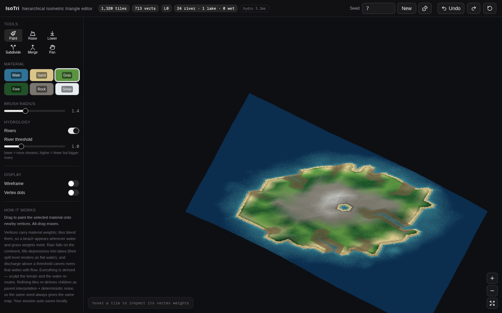
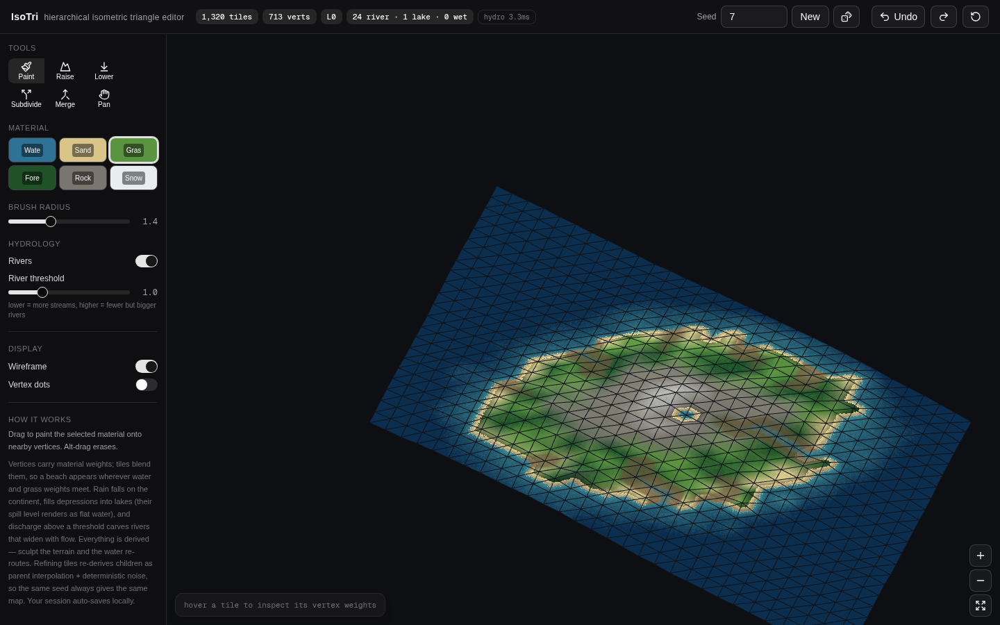

# IsoTri — Hierarchical Isometric Triangle Map Editor

A prototype web editor for maps built on **hierarchical grids of isometric triangular tiles**.

Material properties are not painted onto tiles — they exist as **weights on vertices**, and a *tile factory* blends between them. Put `water = 1` on one vertex and `grass = 1` on the other two and a **beach emerges** along the interpolation gradient. Nothing between the vertices is authored; transitions are computed, not drawn.

Any triangle can be **refined into four deterministic children** (with the other three chiralities in the neighborhood), adding detail via interpolation plus band-limited noise. Rivers, lakes and wetlands are **derived from terrain** by a hydrology core and stamped back into the vertex field — sculpt the land and watch the rivers re-route live.



*Seed world: beaches, ecotones and river networks are all computed from vertex weights and terrain — none of it is painted. Same image with the mesh revealed:*



## How it works

**Vertex weight fields.** Every vertex carries a 6-material weight vector (water / sand / grass / forest / rock / snow) plus elevation, moisture and hydrology stamps. The fragment shader interpolates these across each triangle (barycentric varyings), adds per-pixel domain wobble, and classifies — so coastlines, beaches and ecotones are *iso-lines of the weight field*.

**Deterministic hierarchy.** The core is a pure, DOM-free TypeScript library:

- Vertices are identified by integer lattice coordinates at a fixed point denominator — a vertex is its 2-adic position, so the same physical point has one canonical ID at every level of detail.
- All vertex values are pure functions of `(canonical vertex ID, world seed)` plus explicit user overrides. No wall-clock time, no floating-point coordinate hashing, no `Math.random` — same seed, same planet, byte-for-byte.
- Midpoint children inherit `parent interpolation + hashed noise`; refinement never changes what a coarser view looked like (refine-invariance), and evaluation order never matters (order-independence). These properties are checked by the test suite.

**Hydrology from terrain.** A priority-flood depression filling (Barnes-style min-heap from the ocean) flattens sinks; receivers are the steepest filled-descent (discovery-parent fallback on flats); discharge accumulates in a single topological pass, `acc(u) = rain(u) + Σ acc(child)·loss`, in `O(V log V)`. Discharge above a threshold becomes a river with width ∝ √Q; deep fills become lakes, shallow fills become wetlands that boost riparian moisture. Because stamps are *derived*, editing elevation re-routes rivers automatically.

**Authoritative state is tiny.** The whole document is `{world size, seed, sparse vertex overrides, subdivision structure}` — everything else (weights, hydrology, mesh, rendering) is a deterministic derivation. That is what makes save/load trivial and undo/redo exact, and it is why the map size is just another input: terrain is a pure function of `(seed, geometry)`.

## Quickstart

```bash
npm install
npm run dev        # http://localhost:3000
```

Other scripts:

```bash
npm run build      # production build (also what Vercel runs)
npm run start      # serve the production build
npm run lint
npm test           # core property-test suite (uses bun; or: npx tsx scripts/test-isotri.ts)
```

## Controls

| Tool | Action |
| --- | --- |
| **Paint** | Brush material weights onto vertices (pick a material in the palette; radius/strength sliders) |
| **Raise / Lower** | Sculpt elevation; hydrology re-routes live (rivers avoid new ridges, canyons flood) |
| **Subdivide** | Refine a tile into 4 deterministic children (balanced: neighbors coarsen no faster than one level) |
| **Merge** | Coalesce a refined patch back to its parent tile |
| **Pan** | Drag to pan, wheel / pinch to zoom |

Extras: **map size presets** — Small 22×16 · Medium 30×22 · Large 44×32 · Huge 64×46 root cells (resizing regenerates the world at the same seed, with a two-click confirm; older saved worlds load at their original size); seed input + dice button regenerates the world; hydrology panel toggles rivers and tunes the discharge threshold; undo/redo; hover inspector shows per-corner values; the document auto-saves to `localStorage` and restores on reload; two-click Reset returns to the pristine seed world.

Because the island radius scales with the world, landmass composition stays constant across sizes — Huge is genuinely more continent, not a stretched island. The hydrology solve is `O(V log V)`: even the Huge world (3,055 root vertices, 67 rivers) solves in single-digit milliseconds, so live re-routing stays instant at every size.

## Deploy to Vercel

The repo is a standard Next.js (App Router) project — Vercel auto-detects it, zero configuration.

1. Push this folder to a GitHub repository:

```bash
git init
git add .
git commit -m "IsoTri — hierarchical isometric triangle map editor"
git branch -M main
git remote add origin git@github.com:<you>/isotri-editor.git
git push -u origin main
```

2. Go to [vercel.com/new](https://vercel.com/new), import the repo, click **Deploy** (Framework preset: *Next.js*; build command `next build`, output `.next` — defaults).

…or from the terminal:

```bash
npm i -g vercel
vercel          # preview deployment
vercel --prod   # production
```

No database, no env vars, no server functions — the entire app is client-side.

## Project structure

```
src/
  lib/isotri/            ← the deterministic core (zero DOM, zero deps)
    hash.ts              integer hash, value noise, fBm — the only source of "randomness"
    lattice.ts           fixed-point triangular lattice: vertex IDs, child/parent
                         formulas for both chiralities, point location
    field.ts             vertex values: seed terrain, inheritance + noise,
                         sparse overrides, material classification
    mesh.ts              adaptive triangle mesh: neighbors across levels,
                         balanced subdivide/coalesce, invariants
    hydro.ts             priority-flood filling → receivers → O(V log V)
                         discharge accumulation → river/lake/wetland stamps
    shaders.ts           WebGL2 "tile factory": weight interpolation,
                         wobble, classification, water/river rendering
    engine.ts            renderer + camera + tools + undo + autosave
  components/isotri/     the React UI shell
  app/                   Next.js route (mounts the editor)
scripts/
  test-isotri.ts         property tests: subdivision tiling, parent inverse,
                         balance under random ops, determinism,
                         order-independence, hydrology mass balance
  preview-island.ts      ASCII previews for headless tuning
  preview-hydro.ts
```

## Status & roadmap

Implemented: vertex-weight tile factory · deterministic hierarchy with balanced subdivision · continental hydrology with live re-routing · selectable world size (documented in the save format, back-compatible) · elevation + weight painting · undo/redo · save/load · hover inspection.

Next phases (per the design notes): fine-layer hydrology inheritance (trunk seeding, lake-level clamping), road networks (A* over the weight field, stamped back as overlays), minimap from the coarse LOD, per-edge sharpness flags for walls/canals, WASM port of the core.

## Notes

- The core library is intentionally pure and DOM-free so it can be ported to Rust/WASM or run headless (`scripts/` already does exactly that).
- Tested with Node 20+ / Next 16 / React 19 / Tailwind v4. TypeScript build errors are intentionally not fatal for this prototype (`next.config.ts`).
